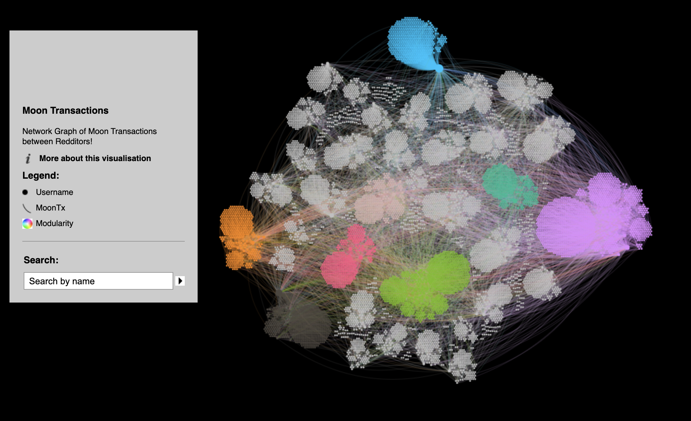

# MoonGraph

Network Graph of Moon Transactions Between Redditors

Last Updated: 07/23/2021, the day of the Moon migration from Rinkeby to Arbitrum.

This visualization shows a network graph of r/CryptoCurrency Moons tips between Redditors.
Visit https://ominousanemone.github.io/MoonGraph/network/ to interact with the tool!

Transaction data was downloaded from a Rinkeby Network API. Only transactions where I was able to verifiably link a blockchain address to a Reddit username are displayed. This was done by cross-referncing the publicly available csv files provided by Reddit during each Moon distribution cycle.

A "tip" is defined as a moon transaction that (1) is a whole number value between 1 and 100 moons, and occurred between two addresses that I can link two Reddit usernames.

All data used was collected from public sources. However, if you're a Redditor included in this visual and wish for your username to not be shown, send u/ominous_anenome a DM on Reddit and I'll do my best (time permitting) to anonymize your name.

Moon tips are appreciated! u/ominous_anenome on Reddit, 0x23dd7421e7ac3ff89454d2d69acef15899f67f2a
